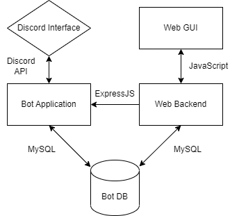

Software Design Description

Project: HarmonyBot

Document Version 1.0

Version date 2/3/2023

https://github.com/sbourgeois02/HarmonyBot

School of Science, Technology and Health, Department of Computer Science,  
Biola University

* * *

Table of Contents

[1 Introduction](#h.rn2c9ejxzuo2)        [3](#h.rn2c9ejxzuo2)

[1.1 Product Overview](#h.5trm5u5nngum)        [3](#h.5trm5u5nngum)

[1.2 Document Version History](#h.dfrph6aemn18)        [3](#h.dfrph6aemn18)

[1.3 Document Intention](#h.9dokdxwgf7ef)        [3](#h.9dokdxwgf7ef)

[1.4 Feature Traceability Matrix](#h.liwvxug02jm1)        [4](#h.liwvxug02jm1)

[2 Architectural Design](#h.3wycifrs50bo)        [7](#h.3wycifrs50bo)

[2.1 Architectural Overview](#h.ayew9k3ui0h3)        [7](#h.ayew9k3ui0h3)

[2.2 Sequence of Interaction](#h.t0su44qsbvq6)        [8](#h.t0su44qsbvq6)

[2.3 Alternate Design Considerations](#h.7gbykbpq18qx)        [9](#h.7gbykbpq18qx)

[3 Components](#h.duzugtt62hfk)        [10](#h.duzugtt62hfk)

[3.1 Database Diagram](#h.iok67aimsn6h)        [10](#h.iok67aimsn6h)

[3.2 Database Description](#h.v4vx6h4rs4ed)        [11](#h.v4vx6h4rs4ed)

[4 User Interface Design](#h.urd6ndtz7os7)        [12](#h.urd6ndtz7os7)

[4.1 User Interface Description](#h.b4n97s3h6hr4)        [12](#h.b4n97s3h6hr4)

[4.2 Sample Screen Image](#h.u18duign2md7)        [12](#h.u18duign2md7)

* * *

# 1 Introduction

## 1.1        Product Overview

We are making an automatic, modular user (or "bot") for the Discord GUI that can assist in a variety of tasks, most notably storing table information on-sight and providing high-quality social interactions with users.

## 1.2        Document Version History

<table class="c32">

<tbody>

<tr class="c44">

<td class="c37" colspan="1" rowspan="1">

Version

</td>

<td class="c19" colspan="1" rowspan="1">

Primary Author(s)

</td>

<td class="c19" colspan="1" rowspan="1">

Description of Version

</td>

<td class="c41" colspan="1" rowspan="1">

Date Completed

</td>

</tr>

<tr class="c23">

<td class="c37" colspan="1" rowspan="1">

SDD v1.0

</td>

<td class="c19" colspan="1" rowspan="1">

Jonathan Yi,  
Matt Stoumbaugh,  
Nathan Schwantes,  
Seth Bourgeois

</td>

<td class="c19" colspan="1" rowspan="1">

Initial Version

</td>

<td class="c41" colspan="1" rowspan="1">

2/03/2023

</td>

</tr>

</tbody>

</table>

# 

## 1.3        Document Intention

This document is intended for management and developers regarding the design and architecture of this project.  As a bot designed for both low and high level interactions, this document may be viewed and referenced by the consumer.

* * *

## 

## 1.4        Feature Traceability Matrix

Project Name: HarmonyBot        Starting Date:        January 13th, 2023        

Project Description: A Discord bot designed for server moderation and basic interaction with its users

<table class="c43">

<thead>

<tr class="c0">

<td class="c13" colspan="1" rowspan="1">

Feature Number

</td>

<td class="c3" colspan="1" rowspan="1">

Feature ID

</td>

<td class="c3" colspan="1" rowspan="1">

Feature Name

</td>

<td class="c16" colspan="1" rowspan="1">

Description

</td>

<td class="c2" colspan="1" rowspan="1">

Status

</td>

<td class="c3" colspan="1" rowspan="1">

Priority

</td>

<td class="c3" colspan="1" rowspan="1">

Root Feature

</td>

</tr>

<tr class="c0">

<td class="c13" colspan="1" rowspan="1">

1

</td>

<td class="c3" colspan="1" rowspan="1">

1.1

</td>

<td class="c3" colspan="1" rowspan="1">

String Tokenizer

</td>

<td class="c16" colspan="1" rowspan="1">

Read and separate words in chat into tokens

</td>

<td class="c2" colspan="1" rowspan="1">

Not Started

</td>

<td class="c3" colspan="1" rowspan="1">

Very High

</td>

<td class="c3" colspan="1" rowspan="1">

Basic (1)

</td>

</tr>

<tr class="c0">

<td class="c13" colspan="1" rowspan="1">

2

</td>

<td class="c3" colspan="1" rowspan="1">

1.1.1

</td>

<td class="c3" colspan="1" rowspan="1">

Command Reader

</td>

<td class="c16" colspan="1" rowspan="1">

Determine if a string is a command and read the string as such

</td>

<td class="c2" colspan="1" rowspan="1">

Not Started

</td>

<td class="c3" colspan="1" rowspan="1">

Very High

</td>

<td class="c3" colspan="1" rowspan="1">

String Tokenizer (1.1)

</td>

</tr>

<tr class="c0">

<td class="c13" colspan="1" rowspan="1">

3

</td>

<td class="c3" colspan="1" rowspan="1">

1.1.2

</td>

<td class="c3" colspan="1" rowspan="1">

Chat Reader

</td>

<td class="c16" colspan="1" rowspan="1">

Determine if a string is not a command and read it as part of basic chat

</td>

<td class="c2" colspan="1" rowspan="1">

Not Started

</td>

<td class="c3" colspan="1" rowspan="1">

Very High

</td>

<td class="c3" colspan="1" rowspan="1">

String Tokenizer (1.1)

</td>

</tr>

<tr class="c0">

<td class="c13" colspan="1" rowspan="1">

4

</td>

<td class="c3" colspan="1" rowspan="1">

1.2

</td>

<td class="c3" colspan="1" rowspan="1">

Permission Reading

</td>

<td class="c16" colspan="1" rowspan="1">

Determine the highest permission level of a user based on their role, enumerated in the “roles” table

</td>

<td class="c2" colspan="1" rowspan="1">

Not Started

</td>

<td class="c3" colspan="1" rowspan="1">

Very High

</td>

<td class="c3" colspan="1" rowspan="1">

Basic (1)

</td>

</tr>

<tr class="c0">

<td class="c13" colspan="1" rowspan="1">

5

</td>

<td class="c3" colspan="1" rowspan="1">

1.2.1

</td>

<td class="c3" colspan="1" rowspan="1">

Role-based Command Denial

</td>

<td class="c16" colspan="1" rowspan="1">

Determine if a user has a high-enough permission level to use a command which they entered, refusing to execute if the user does not have a prerequisite permission level

</td>

<td class="c2" colspan="1" rowspan="1">

Not Started

</td>

<td class="c3" colspan="1" rowspan="1">

Very High

</td>

<td class="c3" colspan="1" rowspan="1">

Permission Reading (1.2)

</td>

</tr>

<tr class="c0">

<td class="c13" colspan="1" rowspan="1">

6

</td>

<td class="c3" colspan="1" rowspan="1">

1.3

</td>

<td class="c3" colspan="1" rowspan="1">

User Moderation

</td>

<td class="c16" colspan="1" rowspan="1">

Establish two moderation tables and an additional column under the “Users” table to track Prohibited Language, Moderation Actions made by the bot, and number of rules violations, respectively

</td>

<td class="c2" colspan="1" rowspan="1">

Not Started

</td>

<td class="c3" colspan="1" rowspan="1">

Very High

</td>

<td class="c3" colspan="1" rowspan="1">

Basic (1)

</td>

</tr>

<tr class="c0">

<td class="c13" colspan="1" rowspan="1">

7

</td>

<td class="c3" colspan="1" rowspan="1">

1.3.1

</td>

<td class="c3" colspan="1" rowspan="1">

Moderation Log

</td>

<td class="c16" colspan="1" rowspan="1">

A log of all the bot’s moderation actions and execution of built-in commands as well as who used them

</td>

<td class="c2" colspan="1" rowspan="1">

Not Started

</td>

<td class="c3" colspan="1" rowspan="1">

Very High

</td>

<td class="c3" colspan="1" rowspan="1">

User Moderation (1.3)

</td>

</tr>

<tr class="c0">

<td class="c13" colspan="1" rowspan="1">

8

</td>

<td class="c3" colspan="1" rowspan="1">

1.3.2

</td>

<td class="c3" colspan="1" rowspan="1">

Timed Banlist

</td>

<td class="c16" colspan="1" rowspan="1">

A list of banned users, with an optional timer at the end of which the corresponding user is removed from the list

</td>

<td class="c2" colspan="1" rowspan="1">

Not Started

</td>

<td class="c3" colspan="1" rowspan="1">

Low

</td>

<td class="c3" colspan="1" rowspan="1">

User Moderation (1.3)

</td>

</tr>

<tr class="c0">

<td class="c13" colspan="1" rowspan="1">

9

</td>

<td class="c3" colspan="1" rowspan="1">

1.3.3

</td>

<td class="c3" colspan="1" rowspan="1">

Chat Deletion

</td>

<td class="c16" colspan="1" rowspan="1">

Delete a phrase containing prohibited language from the chat list

</td>

<td class="c2" colspan="1" rowspan="1">

Not Started

</td>

<td class="c3" colspan="1" rowspan="1">

High

</td>

<td class="c3" colspan="1" rowspan="1">

User Moderation (1.3)

</td>

</tr>

<tr class="c0">

<td class="c13" colspan="1" rowspan="1">

10

</td>

<td class="c3" colspan="1" rowspan="1">

1.3.3

</td>

<td class="c3" colspan="1" rowspan="1">

Banned Language Table

</td>

<td class="c16" colspan="1" rowspan="1">

A list of words that are used to send rules violations to users if they are detected using any of the words

</td>

<td class="c2" colspan="1" rowspan="1">

Not Started

</td>

<td class="c3" colspan="1" rowspan="1">

Very High

</td>

<td class="c3" colspan="1" rowspan="1">

User Moderation (1.3)

</td>

</tr>

<tr class="c0">

<td class="c13" colspan="1" rowspan="1">

11

</td>

<td class="c3" colspan="1" rowspan="1">

1.4

</td>

<td class="c3" colspan="1" rowspan="1">

Built-in Commands

</td>

<td class="c16" colspan="1" rowspan="1">

Keep a list of built-in commands that cannot be deleted from the database.

</td>

<td class="c2" colspan="1" rowspan="1">

Not Started

</td>

<td class="c3" colspan="1" rowspan="1">

Very High

</td>

<td class="c3" colspan="1" rowspan="1">

Basic (1)

</td>

</tr>

<tr class="c0">

<td class="c13" colspan="1" rowspan="1">

12

</td>

<td class="c3" colspan="1" rowspan="1">

1.4.1

</td>

<td class="c3" colspan="1" rowspan="1">

Ban

</td>

<td class="c16" colspan="1" rowspan="1">

A command that bans a user, optionally for a limited time.

</td>

<td class="c2" colspan="1" rowspan="1">

Not Started

</td>

<td class="c3" colspan="1" rowspan="1">

High

</td>

<td class="c3" colspan="1" rowspan="1">

Built-in Commands (1.4)

</td>

</tr>

<tr class="c0">

<td class="c13" colspan="1" rowspan="1">

13

</td>

<td class="c3" colspan="1" rowspan="1">

1.4.1.1

</td>

<td class="c3" colspan="1" rowspan="1">

Unban

</td>

<td class="c16" colspan="1" rowspan="1">

A command that removes a ban status from a user.

</td>

<td class="c2" colspan="1" rowspan="1">

Not Started

</td>

<td class="c3" colspan="1" rowspan="1">

High

</td>

<td class="c3" colspan="1" rowspan="1">

Ban (1.4.1)

</td>

</tr>

<tr class="c0">

<td class="c13" colspan="1" rowspan="1">

14

</td>

<td class="c3" colspan="1" rowspan="1">

1.4.2

</td>

<td class="c3" colspan="1" rowspan="1">

Kick

</td>

<td class="c16" colspan="1" rowspan="1">

A command that removes a user from the server.

</td>

<td class="c2" colspan="1" rowspan="1">

Not Started

</td>

<td class="c3" colspan="1" rowspan="1">

High

</td>

<td class="c3" colspan="1" rowspan="1">

Built-in Commands (1.4)

</td>

</tr>

<tr class="c0">

<td class="c13" colspan="1" rowspan="1">

15

</td>

<td class="c3" colspan="1" rowspan="1">

1.4.3

</td>

<td class="c3" colspan="1" rowspan="1">

Mute

</td>

<td class="c16" colspan="1" rowspan="1">

A command that removes the user’s ability to chat for a set amount of time.

</td>

<td class="c2" colspan="1" rowspan="1">

Not Started

</td>

<td class="c3" colspan="1" rowspan="1">

High

</td>

<td class="c3" colspan="1" rowspan="1">

Built-in Commands (1.4)

</td>

</tr>

<tr class="c0">

<td class="c13" colspan="1" rowspan="1">

16

</td>

<td class="c3" colspan="1" rowspan="1">

1.4.3.1

</td>

<td class="c3" colspan="1" rowspan="1">

Unmute

</td>

<td class="c16" colspan="1" rowspan="1">

A command that restores a user’s ability to chat.

</td>

<td class="c2" colspan="1" rowspan="1">

Not Started

</td>

<td class="c3" colspan="1" rowspan="1">

High

</td>

<td class="c3" colspan="1" rowspan="1">

Mute (1.4.3)

</td>

</tr>

<tr class="c0">

<td class="c13" colspan="1" rowspan="1">

17

</td>

<td class="c3" colspan="1" rowspan="1">

1.4.4

</td>

<td class="c3" colspan="1" rowspan="1">

Strike

</td>

<td class="c16" colspan="1" rowspan="1">

A command that assigns a rule violation to a user and optionally for a set amount of time and also sends a warning message.

</td>

<td class="c2" colspan="1" rowspan="1">

Not Started

</td>

<td class="c3" colspan="1" rowspan="1">

High

</td>

<td class="c3" colspan="1" rowspan="1">

Built-in Commands (1.4)

</td>

</tr>

<tr class="c0">

<td class="c13" colspan="1" rowspan="1">

18

</td>

<td class="c3" colspan="1" rowspan="1">

1.4.4.1

</td>

<td class="c3" colspan="1" rowspan="1">

Unstrike

</td>

<td class="c16" colspan="1" rowspan="1">

A command that removes a rule violation from a user.

</td>

<td class="c2" colspan="1" rowspan="1">

Not Started

</td>

<td class="c3" colspan="1" rowspan="1">

High

</td>

<td class="c3" colspan="1" rowspan="1">

Strike (1.4.4)

</td>

</tr>

<tr class="c0">

<td class="c13" colspan="1" rowspan="1">

19

</td>

<td class="c3" colspan="1" rowspan="1">

1.4.4.2

</td>

<td class="c3" colspan="1" rowspan="1">

Clearstrike

</td>

<td class="c16" colspan="1" rowspan="1">

A command that removes all rule violations from a user.

</td>

<td class="c2" colspan="1" rowspan="1">

Not Started

</td>

<td class="c3" colspan="1" rowspan="1">

High

</td>

<td class="c3" colspan="1" rowspan="1">

Strike (1.4.4)

</td>

</tr>

<tr class="c0">

<td class="c13" colspan="1" rowspan="1">

20

</td>

<td class="c3" colspan="1" rowspan="1">

1.4.4.3

</td>

<td class="c3" colspan="1" rowspan="1">

Strikes

</td>

<td class="c16" colspan="1" rowspan="1">

A command that views a user’s rule violations.

</td>

<td class="c2" colspan="1" rowspan="1">

Not Started

</td>

<td class="c3" colspan="1" rowspan="1">

High

</td>

<td class="c3" colspan="1" rowspan="1">

Strike (1.4.4)

</td>

</tr>

<tr class="c0">

<td class="c13" colspan="1" rowspan="1">

21

</td>

<td class="c3" colspan="1" rowspan="1">

1.4.5

</td>

<td class="c3" colspan="1" rowspan="1">

Banlist

</td>

<td class="c16" colspan="1" rowspan="1">

A command that displays a list of banned users.

</td>

<td class="c2" colspan="1" rowspan="1">

Not Started

</td>

<td class="c3" colspan="1" rowspan="1">

High

</td>

<td class="c3" colspan="1" rowspan="1">

Built-in Commands (1.4)

</td>

</tr>

<tr class="c0">

<td class="c13" colspan="1" rowspan="1">

22

</td>

<td class="c3" colspan="1" rowspan="1">

1.4.6

</td>

<td class="c3" colspan="1" rowspan="1">

Modlist

</td>

<td class="c16" colspan="1" rowspan="1">

A command that displays the list of users with a set permission level.

</td>

<td class="c2" colspan="1" rowspan="1">

Not Started

</td>

<td class="c3" colspan="1" rowspan="1">

High

</td>

<td class="c3" colspan="1" rowspan="1">

Built-in Commands (1.4)

</td>

</tr>

<tr class="c0">

<td class="c13" colspan="1" rowspan="1">

23

</td>

<td class="c3" colspan="1" rowspan="1">

1.4.7

</td>

<td class="c3" colspan="1" rowspan="1">

Roles

</td>

<td class="c16" colspan="1" rowspan="1">

View the list of roles and their corresponding permission levels

</td>

<td class="c2" colspan="1" rowspan="1">

Not Started

</td>

<td class="c3" colspan="1" rowspan="1">

High

</td>

<td class="c3" colspan="1" rowspan="1">

Built-in Commands (1.4)

</td>

</tr>

<tr class="c0">

<td class="c13" colspan="1" rowspan="1">

24

</td>

<td class="c3" colspan="1" rowspan="1">

1.4.7.1

</td>

<td class="c3" colspan="1" rowspan="1">

Role Set

</td>

<td class="c16" colspan="1" rowspan="1">

Set a role’s corresponding permission level.

</td>

<td class="c2" colspan="1" rowspan="1">

Not Started

</td>

<td class="c3" colspan="1" rowspan="1">

High

</td>

<td class="c3" colspan="1" rowspan="1">

Roles (1.4.7)

</td>

</tr>

<tr class="c0">

<td class="c13" colspan="1" rowspan="1">

25

</td>

<td class="c3" colspan="1" rowspan="1">

1.4.7.2

</td>

<td class="c3" colspan="1" rowspan="1">

Role Unset

</td>

<td class="c16" colspan="1" rowspan="1">

Reset a role’s corresponding permission level to the lowest one.

</td>

<td class="c2" colspan="1" rowspan="1">

Not Started

</td>

<td class="c3" colspan="1" rowspan="1">

High

</td>

<td class="c3" colspan="1" rowspan="1">

Roles (1.4.7)

</td>

</tr>

<tr class="c0">

<td class="c13" colspan="1" rowspan="1">

26

</td>

<td class="c3" colspan="1" rowspan="1">

1.4.7.3

</td>

<td class="c3" colspan="1" rowspan="1">

Role Clear

</td>

<td class="c16" colspan="1" rowspan="1">

Remove a role from the table.

</td>

<td class="c2" colspan="1" rowspan="1">

Not Started

</td>

<td class="c3" colspan="1" rowspan="1">

High

</td>

<td class="c3" colspan="1" rowspan="1">

Roles (1.4.7)

</td>

</tr>

<tr class="c0">

<td class="c13" colspan="1" rowspan="1">

27

</td>

<td class="c3" colspan="1" rowspan="1">

1.4.8

</td>

<td class="c3" colspan="1" rowspan="1">

SetPerm [Command]

</td>

<td class="c16" colspan="1" rowspan="1">

Set the required permission level to execute a command

</td>

<td class="c2" colspan="1" rowspan="1">

Not Started

</td>

<td class="c3" colspan="1" rowspan="1">

High

</td>

<td class="c3" colspan="1" rowspan="1">

Built-in Commands (1.4)

</td>

</tr>

<tr class="c0">

<td class="c13" colspan="1" rowspan="1">

28

</td>

<td class="c3" colspan="1" rowspan="1">

1.4.9

</td>

<td class="c3" colspan="1" rowspan="1">

Help

</td>

<td class="c16" colspan="1" rowspan="1">

View a list of commands and their required permission levels

</td>

<td class="c2" colspan="1" rowspan="1">

Not Started

</td>

<td class="c3" colspan="1" rowspan="1">

High

</td>

<td class="c3" colspan="1" rowspan="1">

Built-in Commands (1.4)

</td>

</tr>

<tr class="c0">

<td class="c13" colspan="1" rowspan="1">

29

</td>

<td class="c3" colspan="1" rowspan="1">

1.5

</td>

<td class="c3" colspan="1" rowspan="1">

Command Creation

</td>

<td class="c16" colspan="1" rowspan="1">

Allowing users to create their own commands for the bot

</td>

<td class="c2" colspan="1" rowspan="1">

In Progress

</td>

<td class="c3" colspan="1" rowspan="1">

Very High

</td>

<td class="c3" colspan="1" rowspan="1">

Basic (1)

</td>

</tr>

</thead>

<tbody>

<tr class="c0">

<td class="c13" colspan="1" rowspan="1">

30

</td>

<td class="c3" colspan="1" rowspan="1">

1.5.1

</td>

<td class="c3" colspan="1" rowspan="1">

Coding

</td>

<td class="c16" colspan="1" rowspan="1">

Create customizable and modular element of this bot

</td>

<td class="c2" colspan="1" rowspan="1">

Not Started

</td>

<td class="c3" colspan="1" rowspan="1">

High

</td>

<td class="c3" colspan="1" rowspan="1">

Command Creation (1.5)

</td>

</tr>

<tr class="c0">

<td class="c13" colspan="1" rowspan="1">

31

</td>

<td class="c3" colspan="1" rowspan="1">

1.5.1.1

</td>

<td class="c3" colspan="1" rowspan="1">

Add Command

</td>

<td class="c16" colspan="1" rowspan="1">

Create the ability to add a command to the database that the bot can execute

</td>

<td class="c2" colspan="1" rowspan="1">

Not Started

</td>

<td class="c3" colspan="1" rowspan="1">

High

</td>

<td class="c3" colspan="1" rowspan="1">

Command Creation (1.5)

</td>

</tr>

<tr class="c0">

<td class="c13" colspan="1" rowspan="1">

32

</td>

<td class="c3" colspan="1" rowspan="1">

1.5.1.2

</td>

<td class="c3" colspan="1" rowspan="1">

WebGUI Add Command

</td>

<td class="c16" colspan="1" rowspan="1">

Add the ability to add commands from the web interface

</td>

<td class="c2" colspan="1" rowspan="1">

Not Started

</td>

<td class="c3" colspan="1" rowspan="1">

High

</td>

<td class="c3" colspan="1" rowspan="1">

Command Creation (1.5)

</td>

</tr>

<tr class="c0">

<td class="c13" colspan="1" rowspan="1">

33

</td>

<td class="c3" colspan="1" rowspan="1">

1.5.2

</td>

<td class="c3" colspan="1" rowspan="1">

Deletion

</td>

<td class="c16" colspan="1" rowspan="1">

Delete commands that have been added to that database

</td>

<td class="c2" colspan="1" rowspan="1">

Not Started

</td>

<td class="c3" colspan="1" rowspan="1">

High

</td>

<td class="c3" colspan="1" rowspan="1">

Command Creation (1.5)

</td>

</tr>

<tr class="c0">

<td class="c13" colspan="1" rowspan="1">

34

</td>

<td class="c3" colspan="1" rowspan="1">

1.5.2.1

</td>

<td class="c3" colspan="1" rowspan="1">

Delete Command

</td>

<td class="c16" colspan="1" rowspan="1">

Create the ability to delete a command from the discord interface

</td>

<td class="c2" colspan="1" rowspan="1">

Not Started

</td>

<td class="c3" colspan="1" rowspan="1">

High

</td>

<td class="c3" colspan="1" rowspan="1">

Command Creation (1.5)

</td>

</tr>

<tr class="c0">

<td class="c13" colspan="1" rowspan="1">

35

</td>

<td class="c3" colspan="1" rowspan="1">

1.5.2.2

</td>

<td class="c3" colspan="1" rowspan="1">

WebGUI Delete Command

</td>

<td class="c16" colspan="1" rowspan="1">

Create the ability to delete the command from the Web GUI

</td>

<td class="c2" colspan="1" rowspan="1">

Not Started

</td>

<td class="c3" colspan="1" rowspan="1">

High

</td>

<td class="c3" colspan="1" rowspan="1">

Command Creation (1.5)

</td>

</tr>

<tr class="c0">

<td class="c13" colspan="1" rowspan="1">

36

</td>

<td class="c3" colspan="1" rowspan="1">

2.1

</td>

<td class="c3" colspan="1" rowspan="1">

Toggle Menu

</td>

<td class="c16" colspan="1" rowspan="1">

Create a menu that can toggle for enabling or disabling the use of individual commands

</td>

<td class="c2" colspan="1" rowspan="1">

Not Started

</td>

<td class="c3" colspan="1" rowspan="1">

Low

</td>

<td class="c3" colspan="1" rowspan="1">

Peripheral (2)

</td>

</tr>

<tr class="c0">

<td class="c26" colspan="1" rowspan="1">

</td>

<td class="c42" colspan="1" rowspan="1">

</td>

<td class="c42" colspan="1" rowspan="1">

</td>

<td class="c46" colspan="1" rowspan="1">

</td>

<td class="c48" colspan="1" rowspan="1">

</td>

<td class="c42" colspan="1" rowspan="1">

</td>

<td class="c42" colspan="1" rowspan="1">

</td>

</tr>

<tr class="c0">

<td class="c49" colspan="1" rowspan="1">

</td>

<td class="c11" colspan="1" rowspan="1">

</td>

<td class="c11" colspan="1" rowspan="1">

</td>

<td class="c45" colspan="1" rowspan="1">

</td>

<td class="c47" colspan="1" rowspan="1">

</td>

<td class="c11" colspan="1" rowspan="1">

</td>

<td class="c11" colspan="1" rowspan="1">

</td>

</tr>

<tr class="c0">

<td class="c13" colspan="1" rowspan="1">

37

</td>

<td class="c3" colspan="1" rowspan="1">

2.1.1

</td>

<td class="c3" colspan="1" rowspan="1">

Command Toggling

</td>

<td class="c16" colspan="1" rowspan="1">

Implement the ability to enable or disable commands

</td>

<td class="c2" colspan="1" rowspan="1">

Not Started

</td>

<td class="c3" colspan="1" rowspan="1">

Very Low

</td>

<td class="c3" colspan="1" rowspan="1">

Toggle Menu (2.1)

</td>

</tr>

<tr class="c0">

<td class="c13" colspan="1" rowspan="1">

38

</td>

<td class="c3" colspan="1" rowspan="1">

2.2

</td>

<td class="c3" colspan="1" rowspan="1">

Selectable Command Prefix

</td>

<td class="c16" colspan="1" rowspan="1">

Allow the user to change the default prefix (!) to their own prefix that the bot will recognize as the user inputting a command.

</td>

<td class="c2" colspan="1" rowspan="1">

Not Started

</td>

<td class="c3" colspan="1" rowspan="1">

Low

</td>

<td class="c3" colspan="1" rowspan="1">

Peripheral (2)

</td>

</tr>

<tr class="c0">

<td class="c13" colspan="1" rowspan="1">

39

</td>

<td class="c3" colspan="1" rowspan="1">

2.2.1

</td>

<td class="c3" colspan="1" rowspan="1">

Prefix Token Replacement

</td>

<td class="c16" colspan="1" rowspan="1">

Implement the ability to change the preset command prefix permanently

</td>

<td class="c2" colspan="1" rowspan="1">

Not Started

</td>

<td class="c3" colspan="1" rowspan="1">

Very Low

</td>

<td class="c3" colspan="1" rowspan="1">

Selectable Command Prefix (2.2)

</td>

</tr>

<tr class="c0">

<td class="c13" colspan="1" rowspan="1">

40

</td>

<td class="c3" colspan="1" rowspan="1">

2.3

</td>

<td class="c3" colspan="1" rowspan="1">

User Interaction Commands

</td>

<td class="c16" colspan="1" rowspan="1">

A list of harmless built-in commands intended for the lowest permission levels of users

</td>

<td class="c2" colspan="1" rowspan="1">

Not Started

</td>

<td class="c3" colspan="1" rowspan="1">

Low

</td>

<td class="c3" colspan="1" rowspan="1">

Peripheral (2)

</td>

</tr>

<tr class="c0">

<td class="c13" colspan="1" rowspan="1">

41

</td>

<td class="c3" colspan="1" rowspan="1">

2.3.1

</td>

<td class="c3" colspan="1" rowspan="1">

Choose

</td>

<td class="c16" colspan="1" rowspan="1">

Randomly return a single token from a set of inputted tokens

</td>

<td class="c2" colspan="1" rowspan="1">

Not Started

</td>

<td class="c3" colspan="1" rowspan="1">

Very Low

</td>

<td class="c3" colspan="1" rowspan="1">

User Interaction Commands (2.3.1)

</td>

</tr>

<tr class="c0">

<td class="c13" colspan="1" rowspan="1">

42

</td>

<td class="c3" colspan="1" rowspan="1">

2.3.2

</td>

<td class="c3" colspan="1" rowspan="1">

Respond/Ping

</td>

<td class="c16" colspan="1" rowspan="1">

Respond with a stock phrase or a timer indicating the bot’s response time.

</td>

<td class="c2" colspan="1" rowspan="1">

Not Started

</td>

<td class="c3" colspan="1" rowspan="1">

Very Low

</td>

<td class="c3" colspan="1" rowspan="1">

User Interaction Commands (2.3.2)

</td>

</tr>

</tbody>

</table>

* * *

# 

# 2 Architectural Design

## 2.1 Architectural Overview

Our application has two ways in which users can interact with the bot. The first way will be through the discord interface, which is provided for us by Discord. This is communicated with by the Discord API. The bot application is then coded in a language of our choice which will control the bot’s interaction between the database and the interface. The Web GUI allows management of the bot through a browser. This connects to a backend which will communicate these changes to the bot application and to the Bot database.

## 2.2 Sequence Diagrams

When interacting with the bot through the Web GUI, once a command is executed from this interface it will send a signal to the backend that a command has been executed and gives it the information necessary to deal with it (i.e. the name of the command, the user it is being performed on, etc.). The backend will then communicate with the database to update the information necessary as well as alert the bot application that a command has been executed as well as telling it what information will be relevant for it to query in the database. The bot then checks the database for these changes and once it finds these, it updates the server by executing the necessary command and verifying that the command has been correctly executed. Once this is verified, it will return to the web backend that it has been completed and the web backend will update the GUI to display that the command was successfully executed.

When interacting with the bot through the discord interface, the user must type in a command. The bot application will then query the database to see if this command exists and once this is verified, it will query the database to ensure that the user has the proper permissions level in order to execute this command. Once these queries have been completed and all proper information has been verified, it will execute the command.

## 2.3 Alternate Design Considerations

The main alternative consideration in our design was whether to connect the bot application to the web backend directly or to only have them connect indirectly through the MySQL database. By having them connect solely through the MySQL database, this would reduce the complexity of our project by eliminating the need to connect these two components. However, we decided to go with the approach of having them connected as this will reduce the time between an action being taken on the web interface and it resulting in a command in the discord interface. By connecting these components indirectly, the bot application would instead be required to periodically check the database for changes, which is not ideal.

        

# 3 Components

## 3.1 Database Diagram

* * *

## 

## 3.1.1 Database Description

The User table has UserStatusID and UserRoleID, which map to the Status and Role table PrimaryKeys, respectively. Discord also uses User Tags, which are a 4-digit numerical ID used to allow for users with the same username. These tags are not unique, but when paired with the UserName, can uniquely ID a single user. Status and Role are calculated by ID, which are made the Primary Keys and stored as an INT for hierarchical calculations, but also stored as a string for user ease of viewing. The Commands table includes the CommandInput, which is what the user will type to activate the command, and either a CommandAction, which is code to be performed by the bot within Discord, and/or a CommandOutput, which the bot will type into the chat. The bot will compare CommandMinRoleID with the UserRoleID of the user trying to use the command, and if UserRoleID >= CommandMinRoleID execute the command, else return Invalid Permissions and deny execution. There will also be a list of “bad” words that the bot will scan the chat for in order to trigger a moderation. When triggered, it will log the offending user and the offending word, as well as the message that triggered the moderation. The moderation will also increase the UserNumStrikes value in the User table, and take the appropriate action based on the number of strikes.

## 3.2        Bot Description

The computational portion of the bot will be stored directly on Discord’s servers using the discord.py library as a connection point. As the bot joins a specific server room, it becomes a constantly running Python program. NodeJS will be used to connect the bot to an external database that will enable the bot to utilize its intended features as listed in the Feature Traceability Matrix (1.4). The core feature of the bot is the string tokenizer and the text analyzer. The bot will be able to recognize if a message starts with the command prefix (currently planned to be hard-coded to “!”, but with plans to possibly allow the user to choose their own prefix), then parse the command, including any added variables, and run the command’s action and/or reply with the command’s output, as stored in the database. The bot will also analyze all messages for pre-defined (and user-added) words that will cause a moderation, as described in the Database Description (3.1.1). After logging the message, the offending message is deleted from the server, and as the number of strikes that a user has increases, so does the length of their timeout (mute), until on the final strike, they are banned from the server.

# 4 User Interface Design

## 4.1 User Interface Description

The user interface will be a web-based GUI that will allow the server moderators to access the data stored by HarmonyBot’s database. The GUI will show comprehensive lists of all the pertinent information at a glance, along with sorting options that the user can take advantage of to make sifting through the data easier. The user will also be able to access moderative features through the GUI including but not limited to: “add command”, “delete command”, and “ban user”.  

## 4.2 Sample Screen Image

