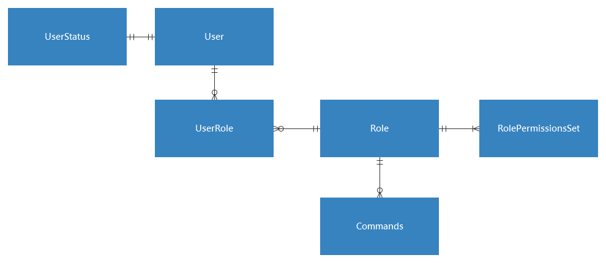

Software Requirements Specifications

Project: HarmonyBot

Document Version 1.0

Version date 1/27/2023

https://github.com/sbourgeois02/HarmonyBot

School of Science, Technology and Health, Department of Computer Science,  
Biola University

* * *

Table of Contents

[1 INTRODUCTION](#h.agwbypn9860i)        [3](#h.agwbypn9860i)

[1.1 Product Overview](#h.93tgp7134x75)        [3](#h.93tgp7134x75)

[1.2 Document Version History](#h.dfrph6aemn18)        [3](#h.dfrph6aemn18)

[1.3 Document Intention](#h.9dokdxwgf7ef)        [3](#h.9dokdxwgf7ef)

[2 SPECIFIC REQUIREMENTS](#h.f07ojghvl6v3)        [4](#h.f07ojghvl6v3)

[2.1 External Interface Requirements](#h.xl2ttrt8y934)        [4](#h.xl2ttrt8y934)

[2.1.1 User Interfaces](#h.39dcoyeqb7sl)        [4](#h.39dcoyeqb7sl)

[2.1.2 Software Interfaces](#h.yuum9pa21dxe)        [4](#h.yuum9pa21dxe)

[2.1.2.1 Web Management Interface](#h.6egb6c8i5664)        [4](#h.6egb6c8i5664)

[2.1.3 Communications Protocols](#h.3hg6ine5qz6x)        [4](#h.3hg6ine5qz6x)

[2.2 Software Product Features](#h.wf8drbirof3b)        [5](#h.wf8drbirof3b)

[2.2.1 Foundational Features](#h.lhikehzb7cyx)        [5](#h.lhikehzb7cyx)

[2.2.2 Moderation Features](#h.8by3a36q1xtz)        [5](#h.8by3a36q1xtz)

[2.2.3 Interaction Features](#h.8v5co2icuebw)        [6](#h.8v5co2icuebw)

[2.3 Software System Attributes](#h.f6xfb9g77w96)        [6](#h.f6xfb9g77w96)

[2.3.1 Reliability](#h.slfiw1xozya1)        [6](#h.slfiw1xozya1)

[2.3.2 Availability](#h.vdhnsqth990a)        [6](#h.vdhnsqth990a)

[2.3.3 Security](#h.1ugczctfwszd)        [7](#h.1ugczctfwszd)

[2.3.4 Maintainability](#h.ylqcvrhzk1pt)        [7](#h.ylqcvrhzk1pt)

[2.3.5 Performance](#h.97hmbi5cn141)        [7](#h.97hmbi5cn141)

[2.4 Database Requirements](#h.1ukk4jkjbkzm)        [8](#h.1ukk4jkjbkzm)

[2.4.1 Concept Diagram](#h.fie2hlbd34n)        [8](#h.fie2hlbd34n)

[2.4.2 Description of Requirements](#h.8ll5biqosjxy)        [8](#h.8ll5biqosjxy)

* * *

# 1        INTRODUCTION

## 1.1        Product Overview

We are making an automatic, modular user (or "bot") for the Discord GUI that can assist in a variety of tasks, most notably storing table information on-sight and providing high-quality social interactions with users.

## 1.2        Document Version History

<table class="c25">

<tbody>

<tr class="c33">

<td class="c31" colspan="1" rowspan="1">

Version

</td>

<td class="c22" colspan="1" rowspan="1">

Primary Author(s)

</td>

<td class="c22" colspan="1" rowspan="1">

Description of Version

</td>

<td class="c38" colspan="1" rowspan="1">

Date Completed

</td>

</tr>

<tr class="c32">

<td class="c31" colspan="1" rowspan="1">

SRS v1.0

</td>

<td class="c22" colspan="1" rowspan="1">

Jonathan Yi,  
Matt Stoumbaugh,  
Nathan Schwantes,  
Seth Bourgeois

</td>

<td class="c22" colspan="1" rowspan="1">

Initial Version

</td>

<td class="c38" colspan="1" rowspan="1">

1/27/2023

</td>

</tr>

</tbody>

</table>

# 

## 1.3        Document Intention

This document is intended for management and developers regarding the technical specifications and requirements for the project. As a bot designed for both low and high level interactions, this document may be viewed and referenced by the consumer.

* * *

# 2        SPECIFIC REQUIREMENTS

## 2.1        External Interface Requirements

### 2.1.1        User Interfaces

The majority of HarmonyBot’s basic operations can be performed using the basic interface provided by Discord.

### 2.1.2        Software Interfaces

Complex interaction with HarmonyBot will require a basic interface to enable or disable features. This interface must be able to recognize and copy user roles from the bot’s database and then re-apply changes in function abilities and assign privileges.

#### 2.1.2.1        Web Management Interface

HarmonyBot will feature a simple, browser-based interface where the user can connect HarmonyBot to a Discord server, as well as manage users and commands.

### 2.1.3        Communications Protocols

HarmonyBot will utilize the Discord API connection between the DB and our bot. HarmonyBot’s WebGUI will exchange the data inputted by the user/moderator and store it in our DB which will be written using MySQL. This data will be visible via the WebGUI.

* * *

## 

## 2.2        Software Product Features

### 2.2.1        Foundational Features

<table class="c25">

<tbody>

<tr class="c1">

<td class="c13" colspan="1" rowspan="1">

Name

</td>

<td class="c13" colspan="1" rowspan="1">

Description

</td>

</tr>

<tr class="c1">

<td class="c13" colspan="1" rowspan="1">

2.2.1.1\. Database access

</td>

<td class="c13" colspan="1" rowspan="1">

Access to a schema using MySQL or a similar database management system, named using a unique server ID

</td>

</tr>

<tr class="c1">

<td class="c13" colspan="1" rowspan="1">

2.2.1.2\. Server Connectivity

</td>

<td class="c13" colspan="1" rowspan="1">

Access to the Discord API for server connections

</td>

</tr>

<tr class="c1">

<td class="c13" colspan="1" rowspan="1">

2.2.1.3\. Text and token analysis

</td>

<td class="c13" colspan="1" rowspan="1">

Ability to read chat channels and tokenize input strings

</td>

</tr>

<tr class="c1">

<td class="c13" colspan="1" rowspan="1">

2.2.1.4\. Command use

</td>

<td class="c13" colspan="1" rowspan="1">

Ability to perform functions based on certain inputs from a text channel

</td>

</tr>

<tr class="c1">

<td class="c13" colspan="1" rowspan="1">

2.2.1.5\. Role and permission recognition

</td>

<td class="c13" colspan="1" rowspan="1">

Ability to enable or disable functions depending on the permission level of a user

</td>

</tr>

</tbody>

</table>

### 

### 2.2.2        Moderation Features

<table class="c25">

<tbody>

<tr class="c1">

<td class="c13" colspan="1" rowspan="1">

Name

</td>

<td class="c13" colspan="1" rowspan="1">

Description

</td>

</tr>

<tr class="c1">

<td class="c13" colspan="1" rowspan="1">

2.2.2.1\. Ban List

</td>

<td class="c13" colspan="1" rowspan="1">

Keep a table of banned users, with an optional timer to prompt the reinstatement of a user

</td>

</tr>

<tr class="c1">

<td class="c13" colspan="1" rowspan="1">

2.2.2.2\. Violations List

</td>

<td class="c13" colspan="1" rowspan="1">

Keep a table of all users with a counter for minor violations that can then prompt addition to the ban list based on a threshold

</td>

</tr>

<tr class="c17">

<td class="c13" colspan="1" rowspan="1">

2.2.2.3\. Text channel moderation

</td>

<td class="c13" colspan="1" rowspan="1">

Keep a table of banned phrases that prompt additions to the list of violations when read in the text channel

</td>

</tr>

</tbody>

</table>

### 

* * *

### 

### 2.2.3        Interaction Features

<table class="c25">

<tbody>

<tr class="c1">

<td class="c13" colspan="1" rowspan="1">

Name

</td>

<td class="c13" colspan="1" rowspan="1">

Description

</td>

</tr>

<tr class="c1">

<td class="c13" colspan="1" rowspan="1">

2.2.3.1\. Canned Response

</td>

<td class="c13" colspan="1" rowspan="1">

Set a table of interactive responses that output when the bot reads specific strings of tokens into the text channel.

</td>

</tr>

<tr class="c1">

<td class="c13" colspan="1" rowspan="1">

2.2.3.2\. Mass user commands

</td>

<td class="c13" colspan="1" rowspan="1">

Set a table of basic bot interactions that do not require user permissions

</td>

</tr>

</tbody>

</table>

## 2.3        Software System Attributes

### 2.3.1        Reliability

HarmonyBot’s features will be repeatable and reliable throughout all levels of the software. DB, source code, and GUI will all run without significant errors/bugs. The user will be able to upload data through the Discord interface and access this data via the online GUI. This data will be synchronized so there will not be any discrepancies between the data uploaded by the bot and the data stored in the DB.

### 2.3.2        Availability

HarmonyBot will run with an uptime of 99.99% SLA. Since we will not be hosting our own services, we will rely on certain Discord services, which have an estimated uptime of 99.999% SLA.

* * *

### 2.3.3        Security

Moderation features of HarmonyBot will only be accessible by users that were permitted by the server administrator. Regular users will not be able to access HarmonyBot’s powerful features (kick/ban/etc). Also, only users permitted by the server administrator will be able to access the online DB. These security measures will protect sensitive information from being accessed by anyone.

### 2.3.4        Maintainability

HarmonyBot will be easily maintainable by the server administrators. The bot interface will have server management features that will allow for easy cleanup of data and information that had previously been organized by the bot. This data will also be manageable through the online DB.

### 2.3.5        Performance

HarmonyBot will be able to encapsulate small amounts of data within the DB, and it should be able to handle any amount of data. We will be storing usernames, messages, and other text-based information in the DB. Since we will not be storing larger data types like images or videos, HarmonyBot will be scalable to accommodate nearly any amount of data without sacrificing performance on a noticeable level.

## 2.4        Database Requirements

### 2.4.1 Concept Diagram

### 2.4.2 Description of Requirements

The database requires the ability to handle information about users, their roles, and what these roles allow them to do. User information includes their status (banned, temporarily muted and information about this mute, or unrestricted) and their role. Role information gives information about manual server permissions (muting other users, assigning roles, channel access) and what commands they are allowed to use.

# 
